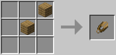

# Wooden Shears 

[.svg)](https://www.curseforge.com/minecraft/mc-mods/wooden-shears)
[.svg)](https://www.curseforge.com/minecraft/mc-mods/wooden-shears/files)

This is a **Minecraft Forge** mod that adds **Wooden Shears** to the game.

For more information check out the **Wiki**: https://github.com/cech12/WoodenShears/wiki