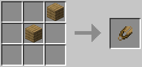

# Wooden Shears 

[.svg)](https://www.curseforge.com/minecraft/mc-mods/wooden-shears)
[.svg)](https://www.curseforge.com/minecraft/mc-mods/wooden-shears/files)

This is a Minecraft mod that adds **Wooden Shears** to the game. (Forge, NeoForge, Fabric, Quilt)

The Fabric / Quilt version needs the following mods:

- Fabric API ([GitHub](https://github.com/FabricMC/fabric), [Curseforge](https://www.curseforge.com/minecraft/mc-mods/fabric-api), [Modrinth](https://modrinth.com/mod/fabric-api)) 
- Cloth Config API ([GitHub](https://github.com/shedaniel/cloth-config), [Curseforge](https://www.curseforge.com/minecraft/mc-mods/cloth-config), [Modrinth](https://modrinth.com/mod/cloth-config))

For more information check out the **Wiki**: https://github.com/cech12/WoodenShears/wiki
